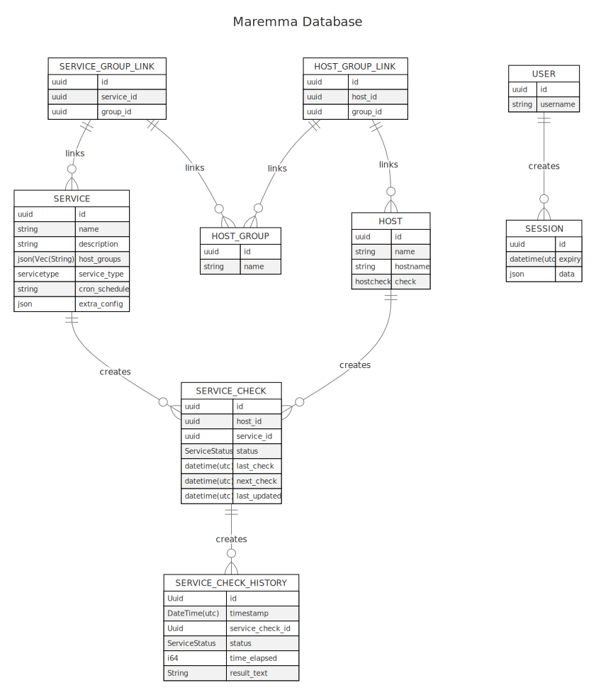
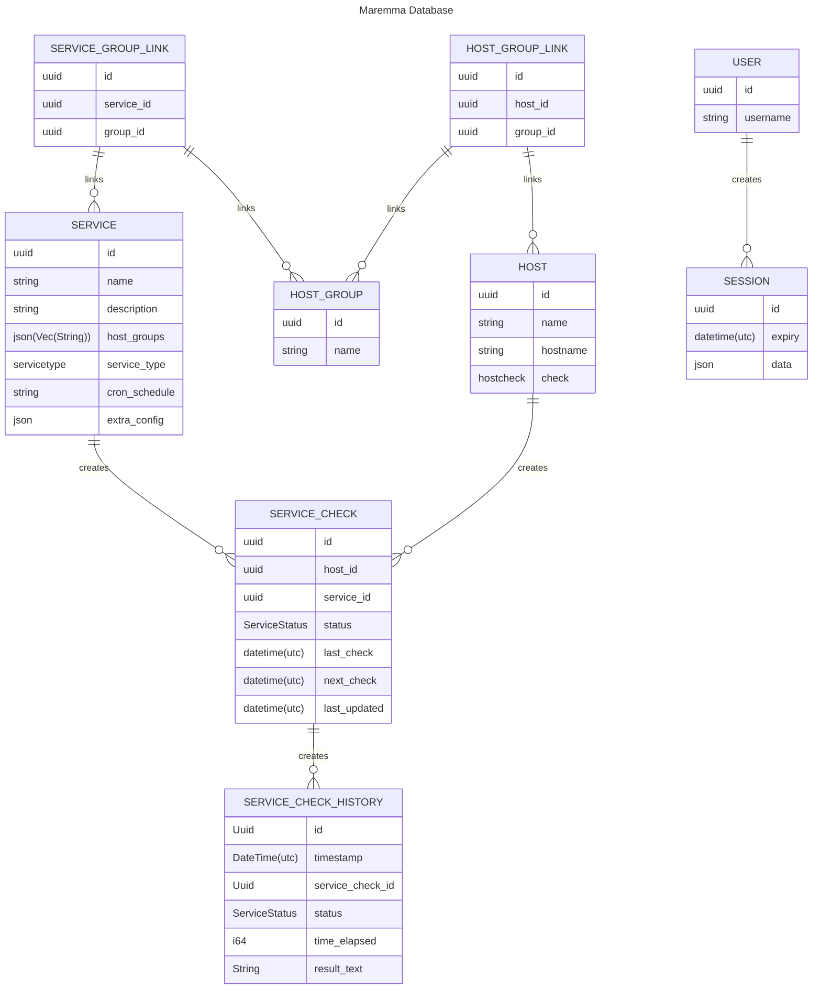

# Database ERD

<!--

```mermaid
---
title: Maremma Database
---
erDiagram
    HOST_GROUP_LINK ||--o{ HOST : links
    
    SERVICE_GROUP_LINK ||--o{ HOST_GROUP : links
    HOST_GROUP_LINK ||--o{ HOST_GROUP : links
    
    SERVICE_GROUP_LINK ||--o{ SERVICE : links
    
    SERVICE ||--o{ SERVICE_CHECK : creates 
    HOST ||--o{ SERVICE_CHECK : creates 

    USER ||--o{ SESSION : creates

    SERVICE_CHECK ||--o{ SERVICE_CHECK_HISTORY : creates

    USER {
        uuid id
        string username
    }

    SESSION {
        uuid id
        datetime(utc) expiry
        json data
    }

    HOST {
        uuid id
        string name
        string hostname
        hostcheck check
    }

    HOST_GROUP {
        uuid id
        string name
    }

    HOST_GROUP_LINK {
        uuid id
        uuid host_id
        uuid group_id
    }

    SERVICE {
        uuid id
        string name
        string description
        json(Vec(String)) host_groups
        servicetype service_type
        string cron_schedule
        json extra_config
    }

    SERVICE_CHECK {
        uuid id
        uuid host_id
        uuid service_id
        ServiceStatus status
        datetime(utc) last_check
        datetime(utc) next_check
        datetime(utc) last_updated
    }

    SERVICE_GROUP_LINK {
        uuid id
        uuid service_id
        uuid group_id
    }

    SERVICE_CHECK_HISTORY {
        Uuid id
        DateTime(utc) timestamp
        Uuid service_check_id
        ServiceStatus status
        i64 time_elapsed
        String result_text
    }

```
-->