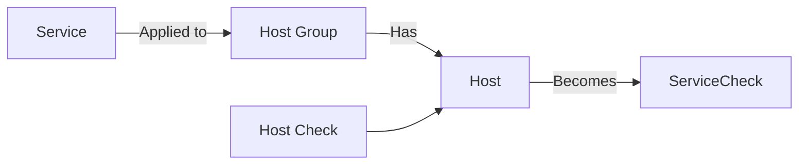
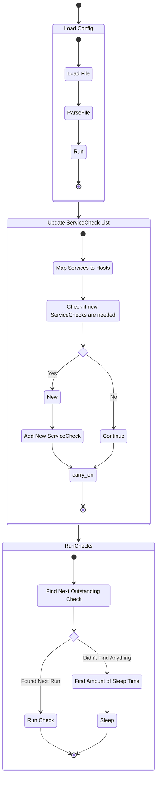

# Objects

```mermaid
flowchart LR;

Group["Host Group"] -- Has --> Host;
Service -- "Applied to" --> Group;

HostCheck["Host Check"] --> Host;

Host -- "Becomes" --> ServiceCheck

```

## Checks

```mermaid
stateDiagram-v2

Config: Load Config
BuildChecks: Update ServiceCheck List

[*] --> Config
Config --> BuildChecks
BuildChecks --> RunChecks

    state Config {
        LoadFile: Load File
        [*] --> LoadFile
        LoadFile --> ParseFile
        ParseFile --> Run
        Run --> [*]
    }

    state BuildChecks {
        state if_state <<choice>>
        state carry_on <<fork>
        Services: Map Services to Hosts
        CheckNewServices: Check if new ServiceChecks are needed
        AddNew: Add New ServiceCheck
        
        [*] --> Services
        Services --> CheckNewServices
        CheckNewServices --> if_state
        if_state --> New: Yes
        if_state --> Continue: No

        New --> AddNew
        
        AddNew --> carry_on
        Continue --> carry_on
        carry_on --> [*]
        
    }

    state RunChecks {
        FindNext: Find Next Outstanding Check
        RunCheck: Run Check
        FindSleepTime: Find Amount of Sleep Time

        state if_found_sleep <<choice>>
        state end_check <<fork>
        
        [*] --> FindNext

        FindNext --> if_found_sleep

        if_found_sleep --> RunCheck: Found Next Run
        if_found_sleep --> FindSleepTime: Didn't Find Anything


        RunCheck --> [*]

        FindSleepTime --> Sleep
        Sleep --> [*]

    }
   

```
